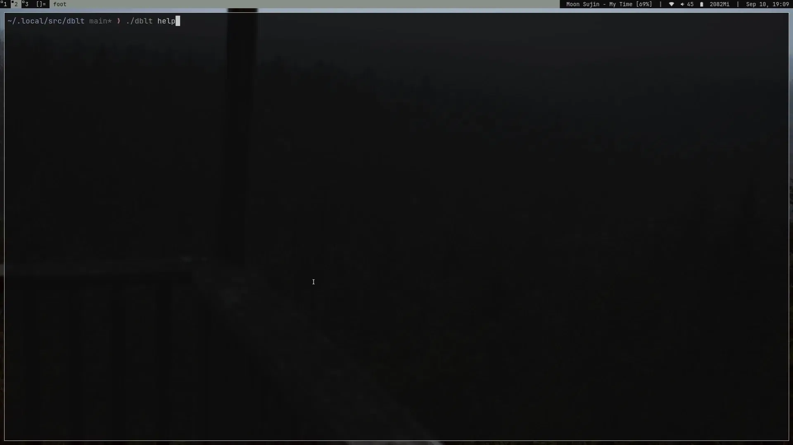

# dblt

**dblt** (short for debloat) is a simple, POSIX-compliant shell script for debloating Android devices via `adb`.
It lets you remove preinstalled apps in bulk, restore them, or interactively pick packages to manage — all from the command line.


---

## Features

- **Debloat** – remove apps listed in one or more `.txt` package lists stored in `./lists`
- **Interactive** – pick packages with [fzf](https://github.com/junegunn/fzf) to install or remove  
- **List** – view all installed and uninstalled packages on the device  
- **Logging** – actions are logged to `~/.cache/dblt` with timestamps  

---

## Setup Guide

```sh
git clone https://codeberg.org/oceanicc/dblt
cd dblt
./dblt d
```

### Requirements

- POSIX-compliant shell
- adb (Android Debug Bridge)
- fzf (only for interactive selection)
- Device must have USB debugging enabled.

## Usage

```sh
./dblt [command]
```

### Commands

- `d | -d | debloat` – debloat device using selected `.txt` package lists
- `i | -i | install` – interactively install packages
- `r | -r | remove` – interactively remove packages
- `l | -l | list` – list all installed and uninstalled packages
- `h | -h | help` – display help message

## Package Lists

dblt expects one or more `.txt` files in the `./lists` directory for debloating.
Each file should contain package names (one per line).
Lines may contain comments using `#`. Both full-line comments and inline comments are supported.

Example `google.txt`:
```
# google.txt
com.android.chrome          # google chrome
com.google.android.youtube  # youtube
```

## Credits

This project’s design and code style were inspired by the [KISS package manager](https://codeberg.org/kiss-community/kiss).

## License

[MIT](https://mit-license.org/)
